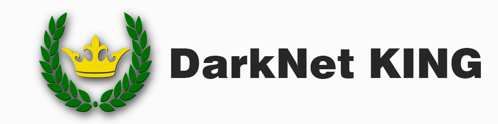

  

# 🌐 DarkNet KING

> ### A curated directory of legal and publicly available resources

🔗 ** Explore DarkNet KING: https://darknetking.com **

---

## 🔎 Why does this matter?

Finding reliable resources on the Tor network can be difficult.

Unlike the regular web, there is no single centralized directory containing every legitimate service. Links are often shared across different communities, and over time they can become outdated, change, or disappear.

That's why **verification and responsible browsing are important**.

---

## 🛡️ Stay safe while browsing

If you're exploring legitimate `.onion` resources, keep a few basic principles in mind:

* 🧅 **Use Tor Browser** to access `.onion` services.
* 🔍 **Verify addresses** before visiting important services.
* ✅ Prefer resources that are maintained and regularly checked.
* 📥 Be careful with unknown files and downloads.
* 🔐 Never enter sensitive information on an unfamiliar website.
* ⚠️ Don't assume that a `.onion` address automatically means a website is trustworthy.

> **Remember:** anonymity and security are not the same thing.

---

## 📚 About DarkNet KING

**DarkNet KING** is a simple directory designed to make **legal and publicly available Tor resources** easier to discover.

The idea is straightforward:

**Find → Verify → Explore**

The directory is intended to serve as a convenient starting point rather than a guarantee that every external service is safe.

### 🔗 Visit the directory

**👉 https://darknetking.com**
